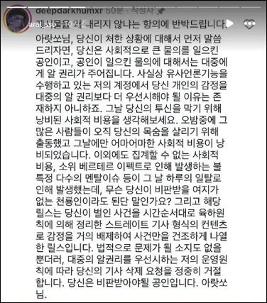

조사를 다 하고, 결론을 지었다.

찬찬히 소개해보겠다.

# 왜 했는가?
최근에 허위정보들에 대해서 말이 많지 않았는가. 언론에 관심을 가지고 있으면 한번 쯤은 탐구를 진행해볼 만한 가치가 있다.

사실 직접적인 이유는 따로 있다.

이 사진은 어떻게 보면 자신의 계정에 보도 비슷한 형식으로 글을 올리는 사람들의 대표적 사례라고 볼 수 있다.

자신들을 "유사언론기능"을 수행하고 있다며 공인에 대한 비판 가능성에 대해 이야기하는데, 판례만 놓고 보면 틀린 말은 아니다.

근데 공인에 대한 비판 기능은 법원이 등록된 언론사에 대한 명예훼손 재판에서 언론사 보호를 위해 주로 쓰는 방식이지, "유사언론기능" 보호를 위해 쓰는 방식은 아닌 것으로 안다.

최근에 저런 계정들이 늘고 있지만, 이들에 대한 조치는 소송 말고는 특별히 없다.

언론사는 언론중재법 등지에서의 제도를 통해 해결할 수 있지만, 저런 계정들은 제도의 공백으로 뭘 할 수가 없다.

이 연구는 저런 계정들도 준언론 취급을 해야 할 때가 아닌가 싶은 의문에서 시작되었다.

# 근데 왜 정보통신망법인가?
나랑 비슷한 문제의식을 가진 사람이 있어서 이미 자료가 있기도 했고, 저런 계정들에 대한 제도가 사실상 이번에 개정된 정보통신망법밖에 없기 때문이다.

이미 분석한 것을 또 분석하자니 부족한 시간과 돈으로 품질이 떨어질 거 같아, 새로운 주제를 꺼내든 것이다.

# 주요 개정 사안은?
1. 증오, 폭력 유도 표현들과 허위, 조작정보가 불법정보로 추가되었다.
2. 불법정보에 대한 징벌적 손해배상 제도(최대 손해액의 5배)가 추가되었다.
3. 방송미디어통신위원회가 불법정보로 판단된 정보 유포에 대해 과징금 부과가 가능해졌다. (판단 완료 이후에도 유포한 경우에만)

법령에 쓰인 단어들도 무언가를 대상으로 삼은 듯한 느낌이 든다.

> 사실이나 의견을 불특정 다수에게 전달하는 것을 업으로 하는 자

이건 언론 기능을 수행하는 일반 SNS 계정들을 어떻게 정의할까에 대한 생각이 들어간 것 같다.

# 인터넷신문과의 연관성
놀랍게도 이 법은 인터넷신문사에도 영향을 미친다.

인터넷신문은 언론사이기도 하지만, 정보통신망을 이용한단 점에서 정보통신망법의 적용을 받기도 한다.

문제는 정보통신망법에는 언론사가 정정보도청구 등을 수행했음에도 이에 대한 확실한 면책권이 없다는 것이다.

언론중재법에도 손해배상 내용이 있긴 하지만, 여차하면 정보통신망법에 근거해서도 얼마든지 손해배상 청구가 가능하다.

당연히 국회도 그걸 생각해서 몇가지 조항을 넣어놓긴 했다.

:::note[개정 정보통신망법 제44조의10]
⑦ 손해배상 청구의 대상이 된 정보의 유통이 오로지 공공의 이익을 위한 것으로서 정보의 유통 당시 그 내용을 진실이라고 믿었고 그와 같이 믿은 것에 상당한 이유가 있는 경우 ... 제1항 및 제3항에 따른 손해배상책임을 지지 아니한다.
:::

저 '공공의 이익을 위한 것'이란 건 형법의 명예훼손 부분에서도 찾아볼 수 있다.

:::note[형법 제310조]
제307조제1항의 행위가 진실한 사실로서 오로지 공공의 이익에 관한 때에는 처벌하지 아니한다.
:::

그리고 이 조항은 언론사에 대한 명예훼손 재판에서 무죄 취지로 판결할 때 많이 쓰이는 조항이다.

아무래도 저 조항을 통해 언론사의 책임을 일부 면제해주려는 것 같다.

# 결론
개인적으로는 저런 SNS 계쩡들에 대한 제도가 갖춰졌다는 것은 바람직하다고 생각한다.

뭐 제도야 악용하려면 끝도 없긴 하겠지만...
판례가 쌓이고 기준이 명확해진다면 그래도 나아지지 않을까

그런데 언론사가 적용될 수 있는 건 조금 지켜봐야 할 것 같다.

만일 적용된 사례가 나온다면 이건 다시 생각해봐야 할 문제가 아닌가 싶다.